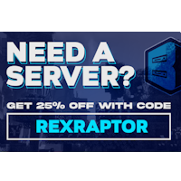

---
navigation:
  title: "Server hosting"
  icon: "nexus:nexus_tracker"
  position: 3
  parent: nexus:bugs_feedback.md
---

# Server hosting

To be able to play the game mode properly, you need a server, which you can also have hosted, giving you easy setup and management. 

----

I recommend [BisectHosting](https://www.bisecthosting.com/selector?plan=minecraft&game_version=java), but you can also use any other provider.

With my code “**REXRAPTOR**” you get a __25% discount__ on your first month at [BisectHosting](https://www.bisecthosting.com/selector?plan=minecraft&game_version=java)!

