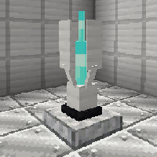
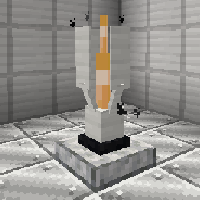
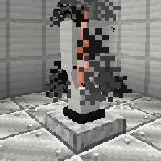

---
navigation:
  title: "Nexus"
  icon: "nexus:nexus_blue"
  position: 1
  parent: nexus:content_description.md
---

# Nexus

<ItemImage id="nexus:nexus_black" />

This block is the core feature of the mod, each team gets a different color and tries to destroy the other nexus blocks. 

-----

__Features:__
- 3 destruction phases 
- Marks all attacking players through walls (configurable) 
- Spreads an effect when right-clicked (configurable)

-----

### The destruction phases

