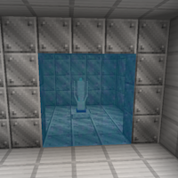

---
navigation:
  title: "Security Barrier"
  icon: "nexus:security_barrier"
  position: 5
  parent: nexus:content_description.md
---

# Security Barrier

<ItemImage id="nexus:security_barrier" />

Similar to the *Security Wall*, this block is non-breakable, non-blastable, has no crafting recipe and is only there to be used by the admins. 

e.g. to be set using command blocks and opened later.

