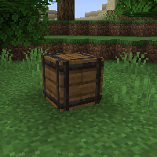
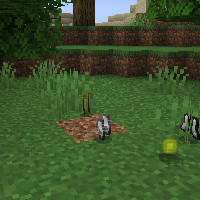

---
navigation:
  title: "Supply Crate"
  icon: "nexus:supply_crate"
  position: 6
  parent: nexus:content_description.md
---

# Supply Crate

<ItemImage id="nexus:supply_crate" />

These blocks can be distributed on the map by the operators before the game begins and drop xp and random loot when destroyed. 

The loot and the amount of XP can be set in the [config file](../gamemode_configuration/server_config_options.md).

  

