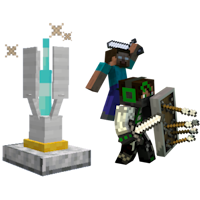
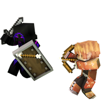

---
navigation:
  title: "Base Setup"
  icon: "minecraft:crafting_table"
  position: 1
  parent: nexus:gamemode_configuration.md
---

# Base Setup

The least you need to do to use game mode is the basic configuration. 
I'll describe how you do that in this chapter. 

-----

First, you have to meet these requirements: 

- A Minecraft Server (either you create one yourself, play over LAN or [get one hosted](../bugs_feedback/server.md) 
- Operator rights on the server

-----

The next steps are the basic configuration in-game: 

1. Place one Nexus in each team base 
2. Create the teams: *<Color id="dark_aqua">/team add <team> [displayName]</Color>* 
3. Assign a color to the teams: *<Color id="dark_aqua">/team modify <team> color [color] </Color>*
(use only red, blue, yellow, green, white or black depending on the nexus color!)  
4. Assign all players to the teams: *<Color id="dark_aqua">/team join <team> [playerName]</Color>* 
5. Further configuration is possible with the [server config](./server_config_options.md) and [additional commands](./additional_configuration.md)

-----

The basic configuration is now complete, each player should now go to their base, and things can start from there. 

The game mode is called __Tower Defense Battle Mode__ and the goal of the game is to find the enemy bases and destroy the Nexus there before your own is destroyed!

 

