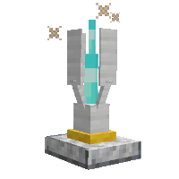

---
navigation:
  title: "Display Slots"
  icon: "minecraft:name_tag"
  position: 5
  parent: nexus:gamemode_configuration.md
---

# Display Slots

Via the *<Color id="dark_aqua">/scoreboard objectives setdisplay</Color>* command, players' scores in specific objectives can be displayed in certain 'slots' in-game. 

Each 'display slot' can show one objective at a time, and multiple 'display slots' may be used for the same or different objectives.

- **list** 
Displays a yellow number or some hearts (*<Color id="dark_aqua">/scoreboard objectives modify <objective> rendertype (hearts|integer)</Color>*) without a heading on the tab menu, where online players are shown. 

- **sidebar** 
Shows on the right hand side of the screen of every player.

- **sidebar.team.<color>** 
There are team-specific sidebar display slots. These operate the same as the standard sidebar slot, but only display to players who are on teams which use the specified color (for example, "*sidebar.team.green*" displays to players on "green" teams) 

- **belowName** 
Shows the *<Score>* followed by the objective's *<DisplayName>* below the player's nametag above their head.

