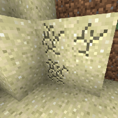
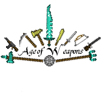
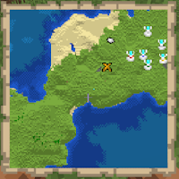
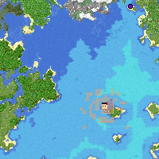
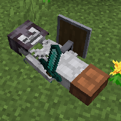
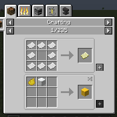

---
navigation:
  title: "Suggestions"
  icon: "minecraft:crafting_table"
  position: 4
  parent: nexus:gamemode_configuration.md
---

# Suggestions

### I'll list a few suggestions on how you can expand your experience here: 

----

- [MultiMine](https://www.curseforge.com/minecraft/mc-mods/multi-mine) (I highly recommend that you install this mod because it makes it possible to break a Nexus with several people at the same time!)

-----

- Weapon mods 
(like [Age of Weapons](https://www.curseforge.com/minecraft/mc-mods/age-of-weapons) (To bring even more variety to the fights!)

-----

- [Supplementaries](https://www.curseforge.com/minecraft/mc-mods/supplementaries) (With this mod you can create search- or overview-maps for your players, when you right-click with a map on a Nexus or Supply Crate)

-----

- [FTB Chunks](https://www.curseforge.com/minecraft/mc-mods/ftb-chunks-forge) (Allows the team leaders or admins to claim the chunks of the nexus bases to prevent blocks from being built or mined there. But remember that the nexus still has to be free!)

-----

- [Corpse](https://www.curseforge.com/minecraft/mc-mods/corpse) (Leaves the players' corpses with their loot lying on the ground instead of just dropping the items)

-----

- [JEI](https://www.curseforge.com/minecraft/mc-mods/jei) (The most popular recipe viewer mod)

